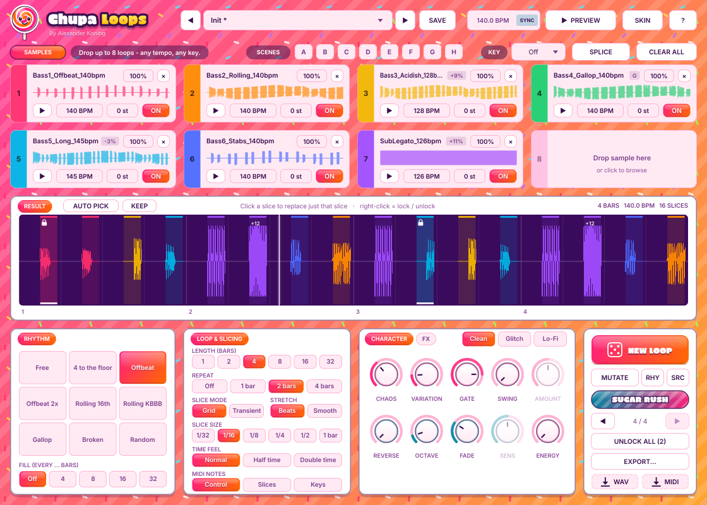
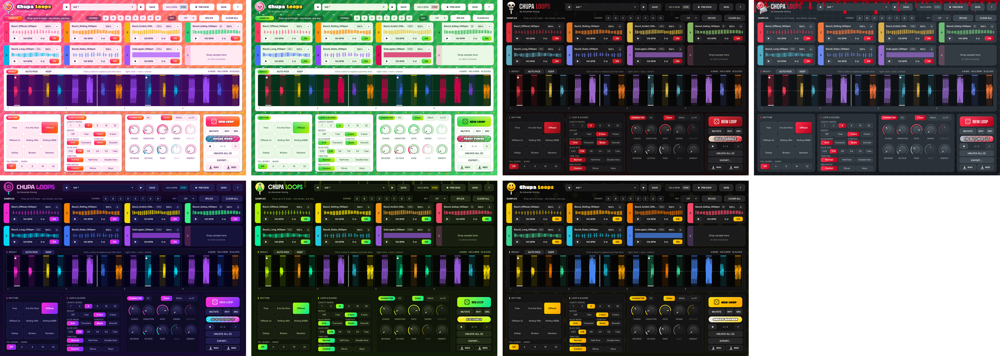

# Chupa Loops

**Loop slicer & loop generator** for Fender Studio Pro, Cubase, Ableton Live, Logic Pro, FL Studio, Bitwig, Reaper and every other VST3/AU host, by Percep-tion.

Feed it up to 8 loops (basslines, for example). Chupa Loops cuts them into slices taken from anywhere in the loops and builds a new 1 to 32 bar loop on the rhythm you choose. Don't like it? Hit **NEW LOOP** until you love it.



## Features

- **8 sample slots.** Drag in samples from Finder/Explorer, **Splice** or your DAW's browser, or click a slot to browse. You can drop several files at once.
- **Automatic tempo and key.** Tempo and key are read from the file name, Splice style (`128bpm`, `_140_`, `Am`, `Fmin`). Without them, the tempo comes from the loop length plus a beat analysis of the audio, and the key from a chroma analysis (never for drum loops). Loops at another tempo are fitted in one of two ways:
  - **Beats** (default) re-slices on the grid, so attacks and gaps stay exactly as recorded.
  - **Smooth** is a high-quality time-stretch (Signalsmith Stretch).
- **Key match.** Choose a key and every sample with a known key is transposed to fit. Each slot can also be transposed by up to ±12 semitones.
- **Rhythms:** Free, 4 to the floor, Offbeat, Offbeat 2x, Rolling 16th, Rolling KBBB, Gallop, Broken, Random, plus a phrase **Fill** every 4, 8, 16 or 32 bars.
- **Style:** **Clean** (seamless, phase-aligned joins), **Glitch** (stutters, tape stops, chops) or **Lo-Fi** (crunchy vintage sampler).
- **100 presets** in 10 flavors (Trance Treats, Hard Candy, Psy Sweets, Techno Toffee, House Candy, Breakbeat Brittle, Glitch Gummies, Lo-Fi Liquorice, Rave Candy, Pick 'n' Mix), a preset browser with search, and your own presets as files you can share.
- **7 skins:** Lolly, Fruity, Skull, Butcher, Neon, Acid and Smile, each with a lolly mascot that reacts when you make a new loop (Lolly and Fruity share the swirl lolly in their own colours).
- **The craziest loop ever:** every skin has its own wild button (Sugar Rush, Fruit Punch, Skull Damage, The Butcher Cut, Neon Overdrive, Acid Flashback, Smiley Mayhem) that throws the rhythm, slicing and character around and makes a new loop.
- **FX rack** (finishing layer on the whole loop): low-pass with per-slice envelope, resonance, low cut, drive, sidechain pump and stereo width.
- **FIT TO TRACK:** right-click a sample and mark it as *my track*. That slot is not sliced: the new loop leaves room where your track is busy (a 1/16 grid profile of its energy) and the key follows it.
- **Share per sample:** how often slices come from each slot (0-200%), and a play button to hear a sample on its own.
- **Energy:** the loop gets busier and more glitchy towards the end.
- **Time feel:** half time or double time on the sample material, with the beat grid unchanged.
- **AUTO PICK:** makes eight loops, scores them (full enough, punchy, nicely spread, varied) and keeps the best one. **KEEP** parks a loop in the first free scene.
- **RHY / SRC:** re-roll only the rhythm (same sounds) or only the sources (same groove).
- **MUTATE** (a variation: a quarter of the unlocked slices change) and **scenes A–H** to store and recall favorite loops live.
- **Play it as an instrument** (MIDI NOTES): **Slices** = C1 plays the whole loop, C#1 and up every different slice; **Keys** = the loop follows the key you play (C3 = original pitch).
- **MIDI control** (MIDI NOTES = Control; note names with middle C = C3): C1 = new loop, C#1/D1 = previous/next version, D#1 = unlock all, E1 = the skin's crazy button, F1 = mutate, C2–G#2 = rhythm, C3–F3 = length, C4–G4 = scenes A–H, program change = preset (0 = Init, 1–100 = factory presets). Right-click any knob or selector to **MIDI learn** a CC. The **New Loop** parameter can be automated.
- **Fix one slice at a time.** Click a slice to replace just that slice. Right-click to lock it. Use ◀ ▶ to go back to earlier versions (with their settings).
- **Plays in sync** with your DAW. **PREVIEW** lets you listen without the transport.
- **Into your project:** drag the loop out as **WAV** or as **MIDI** (one note per slice), or export a WAV, a MIDI file, a **slice kit** (every slice as a WAV + the MIDI) or **stems** (one WAV per sample).
- **Saved with your project,** including the samples themselves (embedded FLAC, up to 64 seconds per slot).
- **Standalone app** included, and a short first-run tour.
- **Checked** in every build with Apple's `auval`, Tracktion's `pluginval` and the engine tests (logged, non-blocking). The audio, preset and MIDI tests in `tests/` run locally.



## Download & install

Go to **Releases** (right-hand side of this page).

- **Mac:** download `ChupaLoops-macOS.dmg`, open it and double-click **Chupa Loops Installer.pkg**.
- **Windows:** download `ChupaLoops-Windows-Setup.exe` and run it.

Restart your DAW. Chupa Loops is listed under **instruments** (Percep-tion → Chupa Loops).
The `.zip` files are for manual installs without an installer.

The full manual is in `docs/Chupa Loops Manual.pdf`.

## Code signing

Without certificates the Mac build is ad-hoc signed and the Windows build is unsigned: macOS and Windows show a warning the first time (on macOS: System Settings → Privacy & Security → Open Anyway). Add these repository secrets (Settings → Secrets and variables → Actions) and the next build is signed (and notarized on Mac) automatically:

| Secret | What |
|---|---|
| `MACOS_APP_CERT_P12` | base64 of your *Developer ID Application* certificate (.p12) |
| `MACOS_INSTALLER_CERT_P12` | base64 of your *Developer ID Installer* certificate (.p12) |
| `MACOS_CERT_PASSWORD` | password of the .p12 files |
| `APPLE_ID`, `APPLE_TEAM_ID`, `APPLE_APP_PASSWORD` | for notarization (app-specific password) |
| `AZURE_TENANT_ID`, `AZURE_CLIENT_ID`, `AZURE_CLIENT_SECRET`, `AZURE_TS_ENDPOINT`, `AZURE_TS_ACCOUNT`, `AZURE_TS_PROFILE` | Windows, recommended: Azure Trusted Signing (new certificates can no longer be exported as .pfx files) |
| `WINDOWS_CERT_PFX`, `WINDOWS_CERT_PASSWORD` | Windows, only for an older exportable certificate: base64 of the .pfx and its password |

## Building

```bash
cmake -B build -G Xcode              # or: -G "Visual Studio 17 2022"
cmake --build build --config Release
```
JUCE and Signalsmith Stretch are downloaded automatically. `.github/workflows/build.yml` builds the Mac version (universal: Apple Silicon + Intel) and the Windows version on every push, makes the installers and publishes them under Releases. Factory presets are generated with `python3 tools/make_presets.py`.

## Licenses

- JUCE: AGPLv3, or a JUCE license (the free Starter license has a revenue limit). Check the current terms on juce.com before selling Chupa Loops; the Steinberg VST3 SDK terms apply too.
- Signalsmith Stretch & Linear: MIT.
- Fonts: Inter, Erica One, Boldonse, Tektur and Big Shoulders, all under the SIL Open Font License (see `Resources/fonts`).
